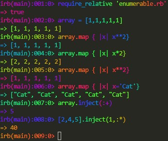

<!-- PROJECT SHIELDS -->
<!--
*** I'm using markdown "reference style" links for readability.
*** Reference links are enclosed in brackets [ ] instead of parentheses ( ).
*** See the bottom of this document for the declaration of the reference variables
*** for contributors-url, forks-url, etc. This is an optional, concise syntax you may use.
*** https://www.markdownguide.org/basic-syntax/#reference-style-links
-->

[![Contributors][contributors-shield]][contributors-url]
[![Forks][forks-shield]][forks-url]
[![Stargazers][stars-shield]][stars-url]
[![Issues][issues-shield]][issues-url]
[![MIT License][license-shield]][license-url]
[![LinkedIn][linkedin-shield]][linkedin-url]

<!-- PROJECT LOGO -->
<br />
<p align="center">
  <a href="https://github.com/jdmartinez1062/Enumerable-Methods">
    
  </a>

  <h3 class ="norse" align="center" style="@font-face {font-family: 'Norse'; src: url('/fonts/Norse.otf'); font-family:'Norse'}">Enumerable Custom Methods</h3>

  <p align="center">
    Custom enumerable's methods created by me
    <br />
    <br />
    <a href="https://ruby-doc.org/core-2.6.5/Enumerable.html">Enumerable Methods Documentation</a>
    
  </p>
</p>

<!-- TABLE OF CONTENTS -->

## Table of Contents

- [About the Project](#about-the-project)
  - [Built With](#built-with)
- [Getting Started](#getting-started)
  * [Prerequisites](#prerequisites)
  * [Installation](#installation)
- [Usage](#usage)
- [Contact](#contact)
- [Acknowledgements](#acknowledgements)

<!-- ABOUT THE PROJECT -->

## About The Project

<p style="display:flex; justify-content:center">
  <a href="https://github.com/jdmartinez1062/Enumerable-Methods">
    
  </a>
</p>

[Microverse](https://www.microverse.org/) Second Ruby Section Main Curriculum Project "Advanced Building Blocks-Enumerables"

Advanced Ruby Building Blocks. [Assignment link](https://www.theodinproject.com/courses/ruby-programming/lessons/advanced-ruby-building-blocks)


### Built With


- [Ruby](https://www.ruby-lang.org)

## Getting Started

### Prerequisites


* Windows
```
https://www.ruby-lang.org/es/documentation/installation/#rubyinstaller
```
* Linux
```
sudo apt-get install ruby-full
```
### Installation

1. Clone the repo

```sh
git clone https://github.com/jdmartinez1062/Enumerable-Methods
```
<!-- USAGE EXAMPLES -->
## Usage

You can use these methods in your own scripts using, the next piece of code in your own scritp
```ruby 
  require_relative 'enumerable.rb'
```
Also, you can use IRB this way: 

1. 
```ruby 
  irb
```
2. 
```ruby 
  require_relative 'enumerable.rb'
```

Now you can create your own variables and use the custom enumerable methods included.
<!-- CONTACT -->

## Contact

Juan David Martínez Cubillos - jd.martinez1062@gmail.com
Mario Barrios - mariobarriossalazar@outlook.com

Project Link: [https://github.com/jdmartinez1062/Enumerable-Methods](https://github.com/jdmartinez1062/Enumerable-Methods)

<!-- ACKNOWLEDGEMENTS -->


<!-- MARKDOWN LINKS & IMAGES -->
<!-- https://www.markdownguide.org/basic-syntax/#reference-style-links -->

[contributors-shield]: https://img.shields.io/github/contributors/jdmartinez1062/Enumerable-Methods.svg?style=flat-square
[contributors-url]: https://github.com/jdmartinez1062/Enumerable-Methods/graphs/contributors
[forks-shield]: https://img.shields.io/github/forks/jdmartinez1062/Enumerable-Methods.svg?style=flat-square
[forks-url]: https://github.com/jdmartinez1062/Enumerable-Methods/network/members
[stars-shield]: https://img.shields.io/github/stars/jdmartinez1062/Enumerable-Methods.svg?style=flat-square
[stars-url]: https://github.com/jdmartinez1062/Enumerable-Methods/stargazers
[issues-shield]: https://img.shields.io/github/issues/jdmartinez1062/Enumerable-Methods.svg?style=flat-square
[issues-url]: https://github.com/jdmartinez1062/Enumerable-Methods/issues
[license-shield]: https://img.shields.io/github/license/jdmartinez1062/Enumerable-Methods.svg?style=flat-square
[license-url]: https://github.com/jdmartinez1062/Enumerable-Methods/blob/master/LICENSE.txt
[linkedin-shield]: https://img.shields.io/badge/-LinkedIn-black.svg?style=flat-square&logo=linkedin&colorB=555
[linkedin-url]: https://linkedin.com/in/othneildrew
[product-screenshot]: finished-screenshot.jpg

